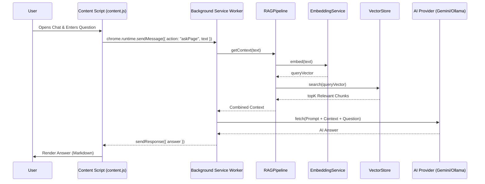

# Project Workflow Analysis: AI Translator Extension

This document provides a comprehensive analysis of the core workflows within the AI Translator EN→VI browser extension. It serves as a blueprint for understanding the current architecture and implementing new features consistently.

## 1. Project Overview

- **Project Type**: Browser Extension (Chrome/Edge Manifest V3)
- **Primary Stack**: JavaScript (ESM), Vite, @huggingface/transformers
- **AI Providers**: Google Gemini (Cloud), Ollama (Local)
- **Architecture**: Modular Service-based Architecture with Background Service Worker and Content Script injection.

---

## 2. Representative Workflows

### Workflow A: Manual Text Translation
**Purpose**: Allow users to instantly translate selected English text on any webpage into Vietnamese using AI.

#### 1. Workflow Overview
- **Trigger**: `mouseup` or `dblclick` event in `content.js`.
- **Involved Files**:
    - `src/content.js`: UI Detection & Popup Management.
    - `src/background.js`: AI API Orchestration.
    - `chrome.storage`: Settings persistence.

#### 2. Implementation Details

**Entry Point (Content Script):**
```javascript
// src/content.js
document.addEventListener("mouseup", (e) => {
  const text = window.getSelection().toString().trim();
  if (text.length > 0 && text.length < 5000) { 
    showTranslateBtn(e.clientX, e.clientY, text); 
  }
});

function doTranslate(text, x, y) {
  chrome.runtime.sendMessage({ action: "translate", text }, (response) => {
    if (response && response.success) {
      updatePopupResult(response.translation, null);
    }
  });
}
```

**Service Layer (Background Worker):**
```javascript
// src/background.js
async function translateText(text) {
  const settings = await getSettings();
  if (settings.provider === "cloud") return translateWithGemini(text, settings.geminiApiKey);
  return translateWithOllama(text);
}

async function translateWithGemini(text, apiKey) {
  const url = `${GEMINI_BASE}/models/${GEMINI_MODEL}:generateContent?key=${apiKey}`;
  const response = await fetch(url, {
    method: "POST",
    body: JSON.stringify({
      system_instruction: { parts: [{ text: SYSTEM_PROMPT }] },
      contents: [{ role: "user", parts: [{ text: text }] }],
    }),
  });
  const data = await response.json();
  return data.candidates?.[0]?.content?.parts?.[0]?.text?.trim() || "";
}
```

---

### Workflow B: RAG-based Page Q&A
**Purpose**: Enable deep understanding of page content by indexing it into a local vector store and using Retrieval-Augmented Generation for answering questions.

#### 1. Workflow Overview
- **Trigger**: User opens the Chat Panel and types a question.
- **Involved Files**:
    - `src/content.js`: Chat UI & Markdown Rendering.
    - `src/background.js`: Message Routing.
    - `src/modules/ragPipeline.js`: Pipeline Orchestrator.
    - `src/modules/embedding.js`: Transformers.js Integration.
    - `src/modules/chunker.js`: Recursive Text Splitting.
    - `src/modules/vectorStore.js`: In-memory Vector Search.

#### 2. Implementation Details

**Indexing Phase:**
1. `content.js` calls `extractPageText()`.
2. `background.js` passes text to `RAGPipeline.indexPage()`.
3. `TextChunker.chunk()` creates segments.
4. `EmbeddingService.embedBatch()` generates vectors using `onnx` models.
5. `VectorStore.add()` stores text + vectors.
6. `RAGPipeline.saveState()` persists indices to `chrome.storage.local` keyed by URL.

**Query Phase:**
1. User sends message via `content.js`.
2. `background.js` calls `RAGPipeline.getContext(question)`.
3. `VectorStore.search()` performs cosine similarity search.
4. Relevant chunks are injected into `QA_SYSTEM_PROMPT`.
5. AI processes the augmented prompt.

---

## 3. Sequence Diagram (RAG Q&A Workflow)



---

## 4. Architectural Patterns

### Data Mapping
- **Input DTOs**: Plain objects passed via `chrome.runtime.sendMessage`.
- **Domain Models**: `RAGPipeline` maintains state in memory, but exports/imports to JSON for storage.
- **Persistence**: `chrome.storage.local` is used for caching vector stores to avoid re-indexing on page reload.

### Error Handling
- **Global Catch**: `background.js` uses `.catch()` on all async message handlers to return `{ success: false, error: msg }`.
- **Validation**: `content.js` checks `isExtensionValid()` to detect cases where the extension was updated/reloaded, prompting a page refresh.
- **UI Feedback**: Popups and Chat Panels display warning icons (⚠️) and specific error messages.

### Asynchronous Patterns
- **Non-blocking Indexing**: Indexing runs in the background. UI polls status via `getIndexStatus` every 500ms to update progress bars.
- **Streaming (Partial)**: While AI responses are currently fetched as blocks, the pipeline architecture supports future streaming integration.

---

## 5. Implementation Templates

### Adding a New Message Action
To add a new background capability:
1. **Content Script**:
   ```javascript
   chrome.runtime.sendMessage({ action: "newAction", data: ... }, (res) => { ... });
   ```
2. **Background Script**:
   ```javascript
   if (request.action === "newAction") {
     handleNewAction(request.data)
       .then(data => sendResponse({ success: true, data }))
       .catch(e => sendResponse({ success: false, error: e.message }));
     return true; // Keep channel open for async
   }
   ```

### Adding a New Module
New modules should follow the class-based pattern used in `src/modules/`:
```javascript
class NewService {
  constructor() { ... }
  async process(data) { ... }
}
export default new NewService(); // Singleton pattern
```

---

## 6. Implementation Guidelines

### Common Pitfalls
1. **Context Invalidation**: If the extension reloads, content scripts lose connection. Always check `chrome.runtime.id`.
2. **Large Page Performance**: Massive pages can slow down embedding. Use `TextChunker` to manage limits.
3. **API Rate Limits**: Gemini has quotas. Implement local caching where possible (already done for RAG).

### Extension Mechanisms
- **Provider Switching**: Easily add new LLM providers by adding a `askWith[Provider]` function in `background.js` and updating the `askPage` logic.
- **UI Styling**: All styles are encapsulated in `content.css` and `popup.css` using `ai-translator-` prefixes to avoid page CSS conflicts.

---

## 7. Conclusion
The project follows a clean separation between UI (`content.js`), Orchestration (`background.js`), and Logic (`modules/`). Consistency is maintained through shared message protocols and modular service definitions. Future development should prioritize keeping the background worker lean and leveraging the existing `RAGPipeline` for any content-aware features.
